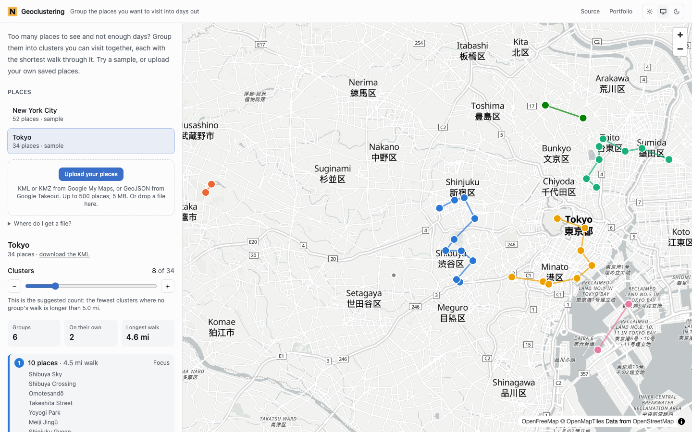
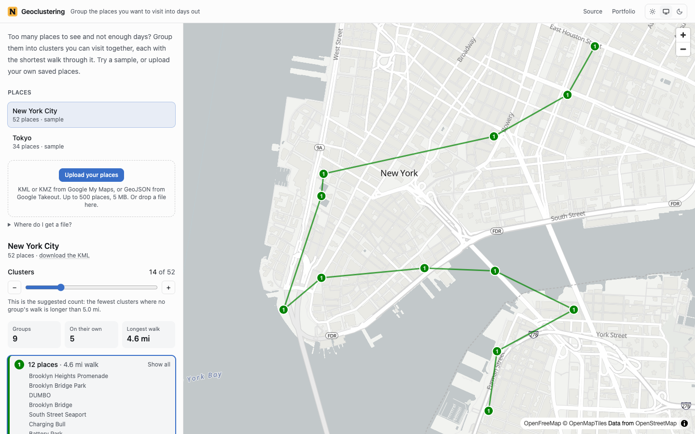
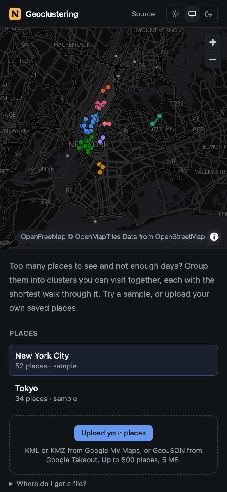

# Geoclustering

[](https://github.com/nickjmorrow/geoclustering/actions/workflows/ci.yml)

Too many places saved and not enough days to see them. Upload your saved
places from Google Maps, and this groups them into clusters you can visit in a
day, each with the shortest walk through it.

**Live demo: [geoclustering.204-168-227-216.sslip.io](https://geoclustering.204-168-227-216.sslip.io)**:
pick Tokyo, drag the slider, and click a group to see its walk. No sign-up, and
nothing you upload is kept on the server.

<picture>
  <source media="(prefers-color-scheme: dark)" srcset="docs/screenshots/desktop-dark.png">
  
</picture>

When I moved to New York in 2018 I had a long list of places to visit, and
thought it would be fun to cluster them to "maximize the number of places I
could visit in a weekend." I spent more time building this than visiting
places, and it ran for a couple of years until its database host went away. In
2026 it was rebuilt from the ground up: see [what changed](#what-changed-in-the-2026-rebuild).

The clustering is [agglomerative hierarchical clustering](https://en.wikipedia.org/wiki/Hierarchical_clustering),
done **once** per file: the server sends the whole merge tree, so every
position of the slider is already computed and moving it is instant. Within
each group, the order to visit places in is solved exactly for up to ten places
and near-optimally up to sixty.

.NET 10 + React + MapLibre. Two containers, one command, **no database and no
API keys.** The conventions, and the reasoning behind them, live in
[AGENTS.md](./AGENTS.md).

## Design decisions and trade-offs

- **Cluster once, explore freely.** The API returns the full dendrogram: every
  place, every merge, and every cluster that exists at any level, each with its
  center, spread and walking route. Going from 8 clusters to 9 undoes one merge
  in the browser, and nothing is sent to the server. *Trade-off:* the response
  grows with the depth of the tree as well as the number of places, which is
  why an upload is capped at 500 places.
  [More](./AGENTS.md#the-dendrogram-is-the-contract)
- **Centroid linkage, deterministic.** Clusters merge by the distance between
  their centers, with ties broken by index, so the same file always clusters
  the same way. No k-means, no random restarts, and no need to choose *k*
  before you've seen the answer. *Trade-off:* O(n³) in the worst case; 500
  places take well under a second, but this is not the algorithm for a
  million.
- **Routes are open paths, solved properly.** A day out starts at one place and
  ends at another, so the walk is a shortest Hamiltonian *path*, not a round
  trip. It's exact for up to ten places (Held–Karp, O(n²·2ⁿ)); nearest-neighbour
  from every start plus 2-opt for up to sixty; and not computed for larger
  groups, which no one would walk anyway. *Trade-off:* distances are
  straight-line (great-circle), not along streets.
- **"Suggested" means a day's walk.** The starting cluster count is the fewest
  clusters in which no group's walk is longer than 8 km (5 mi). That's a
  claim a visitor can check, unlike an elbow in a curve. *Trade-off:* it
  assumes walking; a city you'd cross by train deserves fewer, bigger clusters,
  and the slider is there for that.
- **A stateless API; uploads live in your browser.** There are no accounts, so
  there is nobody to save a file *for*. The server clusters what it's sent and
  forgets it; the browser keeps your last five uploads. *Trade-off:* uploads
  don't follow you between devices, and a link can share a sample but not
  your own file.
- **No API keys anywhere.** The map is [MapLibre GL](https://maplibre.org/) on
  [OpenFreeMap](https://openfreemap.org/) tiles: free, open, with a light and a
  dark style from the same data, so the map follows the theme. *Trade-off:* it
  depends on a community-run tile host, and there is none of Google's place
  data. That was never needed: your places come from the file.
- **Uploads are treated as hostile.** XML DTDs are refused (no entity expansion
  and no external fetches), a KMZ is unzipped with a hard size cap rather than
  trusting its header, uploads are limited to 5 MB and to 20 per visitor per
  minute, and place names are only ever rendered as text.
- **Color follows the cluster, not its rank.** When a cluster splits, the
  larger half keeps its color, so moving the slider one step recolors at most
  one group. Every group also carries its number on the map and in the list,
  so color is never the only cue.
  [More](./AGENTS.md#color)

## Screenshots

<table>
  <tr>
    <td width="68%"></td>
    <td width="32%"></td>
  </tr>
  <tr>
    <td>Click a group and the map zooms to it and dims the rest. Its places are
    listed in the order to walk them.</td>
    <td>On a phone, the map sits above the controls.</td>
  </tr>
</table>

## Using your own places

The app reads the formats Google gives your places out in:

- **Google My Maps**: open a map, choose **⋮ → Export to KML/KMZ**, and upload
  the file.
- **Starred and saved places**: at [takeout.google.com](https://takeout.google.com),
  export **Saved**, unzip it, and upload **Saved Places.json**.
- Anything else that writes KML, KMZ or GeoJSON points works too. Lines and
  shapes are skipped, and the app says how many.

Each sample has a *download the KML* link, if you want to see what an upload
looks like.

## Quick start

Needs Docker.

```bash
docker compose up
```

Then open <http://localhost:3003>. Both halves hot-reload from your checkout.

| Service | URL |
| --- | --- |
| App | <http://localhost:3003> |
| API | <http://localhost:8003> |
| API reference | <http://localhost:8003/api/docs> |

The ports are 3003 and 8003 so this runs alongside the author's other projects.

## Working on it

```bash
scripts/setup.sh           # once per clone: dependencies and the pre-commit hook
scripts/check.sh           # format, lint, types, tests and build, both halves
scripts/check.sh --fast    # the subset the hook runs: no production build
```

One script, three callers: you, the pre-commit hook, and CI. A hook that
checks something different from CI is worse than no hook.

No .NET SDK installed? `check.sh` runs the backend's checks inside the SDK's
Docker image instead, with the same commands. Nothing in either test suite
needs a database, a network connection or a key.

## Deploying it

```bash
cp .env.prod.example .env.prod
docker compose -f docker-compose.prod.yml --env-file .env.prod up --build -d
```

| | Development | Production |
| --- | --- | --- |
| Frontend | Vite dev server | Built bundle on nginx, which also proxies `/api` |
| Backend | `dotnet watch` on the SDK image | Published build on the ASP.NET runtime image |
| Reload | Hot, with source mounts | None; the image is the artifact |
| Backend user | root | Unprivileged `app` |
| Backend port | Published on 8003 | Not published; only nginx reaches it |
| Logs | Human-readable | JSON |

### The public demo

```bash
scripts/deploy.sh root@204.168.227.216    # → https://geoclustering.204-168-227-216.sslip.io
```

One server over SSH, safe to re-run. It installs Docker and Caddy if they're
missing, picks a free local port, copies the code, builds, and puts Caddy in
front for HTTPS. Everything it creates is named after the app, so it shares a
server with the author's other demos without touching them. Unlike theirs, it
needs no nightly reset: there is nothing on the server for a visitor to
change.

## Stack

| Layer | Choice |
| --- | --- |
| Backend | .NET 10 (LTS), ASP.NET Core minimal APIs |
| API docs | OpenAPI (`Microsoft.AspNetCore.OpenApi`) with a [Scalar](https://scalar.com/) reference at `/api/docs` |
| Errors | RFC 9457 problem details, with a sentence written for the person who uploaded the file |
| Frontend | React 19, Vite, TypeScript, Tailwind v4, TanStack Query |
| Map | MapLibre GL JS on OpenFreeMap vector tiles |
| Node deps | pnpm |
| Tests | xUnit v3 on Microsoft.Testing.Platform (backend); Vitest (frontend) |
| Lint and format | `dotnet format` with analyzers, warnings as errors (backend); ESLint and Prettier (frontend) |
| CI | GitHub Actions, running the same `scripts/check.sh` as the pre-commit hook |
| Hosting | Docker Compose behind Caddy on one small VM |

## Project layout

```
backend/src/Geoclustering.Clustering/   The algorithm: clustering, routes, distances.
                                        Pure functions; no ASP.NET, no I/O.
backend/src/Geoclustering.Api/          Minimal API, file parsing (KML, KMZ, GeoJSON),
                                        and the samples, embedded as KML files.
backend/tests/Geoclustering.Tests/      Algorithm, parser and HTTP tests.
frontend/src/dendrogram.ts              Clusters, summaries and colors at any level,
                                        derived in the browser from the merge tree.
frontend/src/components/ClusterMap.tsx  The only component that talks to MapLibre.
scripts/                                setup.sh, check.sh and deploy.sh.
AGENTS.md                               The conventions, and the reasoning.
```

## What changed in the 2026 rebuild

The original (2018–2020) was a .NET Core 2.1/3.1 API with EF Core *preview*
packages, a Create React App frontend on Redux-Saga and an abandoned Google
Maps wrapper, and Postgres on ElephantSQL, deployed to Heroku and Netlify.
Its sign-in never worked (the token method threw `NotImplementedException`),
its route lines were drawn in the wrong order, and 5,000 files of
`node_modules` were committed.

The rebuild keeps the idea and the C# (the algorithm was ported and then
rewritten) and replaces everything around it:

- **.NET 10 minimal APIs** instead of MVC controllers on end-of-life runtimes.
- **No database.** It only ever held the samples and a sign-in that didn't
  work; the samples are now embedded files, and uploads live in the browser.
- **No Google API key.** MapLibre and OpenFreeMap replace Google Maps, and the
  exposed keys in the old code are no longer used by anything.
- **Routes solved properly.** The old ordering was a brute-force tree search
  over *squared* degree differences, returning a round trip; now it's
  Held–Karp or 2-opt over real distances, returning an open path.
- **A suggested cluster count**, instead of opening every dataset at "every
  place on its own".
- **A theme picker, a phone layout, keyboard and screen-reader support,
  loading and error states,** and CI.

## What's deliberately not here

- **Accounts.** They would exist only to save uploads, which the browser
  already does, and they would turn a demo anyone can try into one that asks
  for an email first.
- **Street routing.** Walking distances along streets need a routing engine
  and its data. Straight-line distance ranks places correctly for "which are
  near each other", which is the question being asked.
- **Other algorithms** (k-means, DBSCAN). Each needs a parameter chosen before
  you see the answer; the dendrogram gives you every answer at once and a
  slider to pick one.
- **Transit-aware suggestions.** The 8 km day assumes walking. See the
  trade-off above.

## Author

Built by Nicholas Morrow: [nickjmorrow.com](https://nickjmorrow.com) ·
[GitHub](https://github.com/nickjmorrow). MIT licensed; see [LICENSE](./LICENSE).
